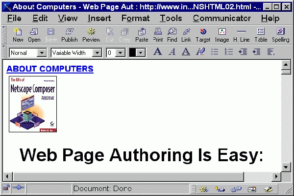

# Is it 2002?

  It all began on a hot summer night a year ago. I was comfortably attached to my bed like always, doing absolutely nothing but breathing... until my father decided to lecture me for a good hour or so out of nowhere, asking about my career plans, how I plan on making billions of dollars in one day, and many other things that parents would ask their children. I told him I didn't have any specific plans, and that I was still unsure of which field of computer science I wanted to dive into. He raised his voice a bit, probably out of frustration that his daughter didn't have any goals. Then he decided to give me a project that scarred me for life; building a website for his business. 
  
  Of course, his intention was good and pure, he just wanted me to explore new things and find something that interests me so I can do something with my life instead of just sitting around all day. However, building a website was so much more than what I expected as a newbie in the world of computer science. Nonetheless, I knew I would much rather build a website than sit through another hour long lecture with my father. I watched tutorials on Youtube all day, slept through some of the videos, and finally felt confident enough to start building this website for my father! 

  
  **_Except I felt like I belonged in the Stone Age._**
  
  Living in the world where new phones come out every few months, have items shipped to your house with just a few clicks and cars that know when to brake and gas, the website I built seemed a little *too* out of the picture. It wasn't clear what the website was even made for, and it almost even looked like a scam. In short, it didn't look appealing at all. My father asked me to update him on the project so I showed him a glimpse of the horrendous "website," and as hard as he tried to hide what he was feeling inside, I could tell that he was almost shocked to see my creation. 
  
  He stopped asking me for updates, I stopped caring for building the website, I started school and no longer was sitting around, my father didn't lecture me anymore, and all was good. I never thought I would encounter HTML again, which was a dumb thought considering how I am a computer science major; I could never escape it even if I tried.
  
  # Rollercoaster Ride
  
  
 
  The beginning of the rollercoaster ride was something I was already familiar with; although I had buried it deep inside of me, I still remembered the basic HTML and CSS well enough to complete the assignments and the WOD. As we changed gear and started heading up, we were introduced to Semantic UI. And so far, I am absolutely fascinated by it. Building a website with Semantic UI is so much easier than I had ever imagined and as long as you know how to use the classes, elements and collections correctly, your website is guaranteed to turn out nicer than building them with pure HTML and CSS. 
  
  It certainly isn't all about rainbows, cupcakes and unicorns but Semantic UI, as well as other UI frameworks, allows for slick outcomes that make up for the obstacles encountered along the way. The information may seem too abundant to take in all at once, but once you get the hang of it, you would never want to go back to using just HTML and CSS; unless you feel adventurous and want to feel like what the cavemen felt, of course. 
  
  Watching 3 hours of the tutorial videos, attempting to imitate exisiting websites which turned out to be a mess, at first, wasn't the most enjoyable thing in the world. But staring at the laptop screen aggressively while sighing out of frustration all stops when you click on the chrome logo on IntellJ IDEA and it shows you a well-constructed website that is almost like a duplicate of the website you were trying to copy. 
  
  One can find the beauty in the fact that something that would have taken someone hours or even days to make using HTML and CSS now takes less than half an hour. Of course, learning new things is always hard, and juggling HTML, CSS and Semantic UI and really getting down to all three of them can be stressful. But it has saved time greatly and made me (who has developed trauma from building a website before) want to look more into web development and UI design again. 
  
  # The Dark Tunnel
  
   In Calculus, they teach you the definition of derivative and tell you to use this formula: 
    to find the slope and the equation of the tangent line. Although it's more of an algebra problem that requires some simplification than calculus, some people get scared and their negative thoughts towards what appears to be a complicated equation prevents them from wanting to move forward. 
   
   If they keep pushing through the tedious process of finding the derivative, they will soon encounter the simple rules we can use to find the derivatives of functions, which, definitely makes life a lot easier than having to plug in the entire function and do algebra every time you want to know what the rate of change is. 
   
   If people knew that applying the rules of derivatives are way easier and faster than using the equation provided above, they would not be discouraged so easily. Similarly, if I had taken the time to do some more research on web development and found out these wonderful frameworks I could use, I would have not given up a year ago after failing to build a perfect website after one try. It is not guaranteed that there always will be an easy way to go about things, but it doesn't hurt to look up how you could save your time and sanity while achieving what you want. 

  There is always a light at the end of a dark tunnel. For me, the dark tunnel was building a website with just HTML and CSS, and the light was Semantic UI and other UI frameworks. For some people, Semantic UI could be the dark tunnel. The point is, although it may seem as if the world is falling apart (I mean, it could actually be falling apart, but we want to be optimistic here), there is something better and brighter than what you are going through. 
  
  The lesson I learned from the past week's module is that getting out of the comfort zone is important, as you will never see what is outside of the tunnel if you just decide to settle inside there. Although it may seem scary and sounds reasonable to just make up excuses for not striving for more, I think it is important to be bold and experience new things; I mean, who knows what we are going to find?
