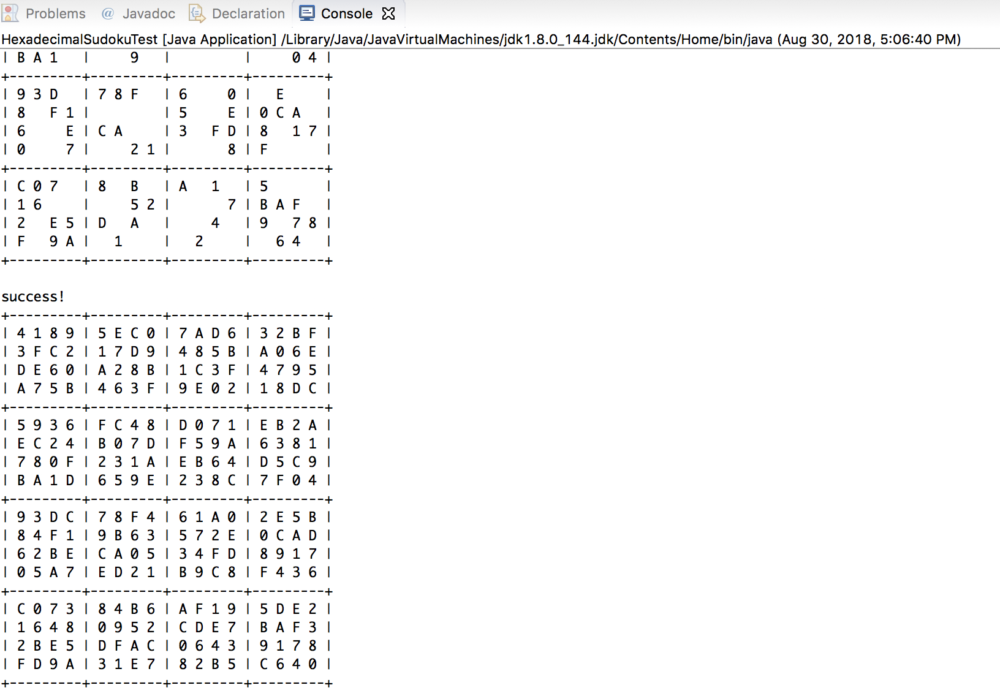

Hexadecimal sudoku is a 16x16 sudoku that solves the puzzle so that no values between 1 and 9, A and F are used more than once on the same line going vertically, horizontally AND diagonally. If the same number repeats in any way in any direction, the puzzle solver may need to reconsider their choice of the input. When the solver completes the sudoku without the numbers conflicting, then the puzzle is considered complete and correct. 

For this assignment, I had to create a program that takes in an incomplete sudoku puzzle as an input and outputs a correct, completed conditions recursively. The program achieves this by running numerous functions to check the values that already exist in the sudoku and finding the ultimate solution that satisfies all the conditions. If it has found the correct solution it will print the result in the console of the user's IDE. The program scans and examines each row until reaching an empty space marked as the value -1 in the 16x16 array, and inserts a valid number and continues to repeat the same process. If it turns out that there is no value that meets the expectations of the slot, the program will use backtracking method to take a step back and find a valid value that can be used to occupy the empty slot.

In my experience, this assignment was by far the most difficult assignment given in ICS 211. This was also the assignment I needed a lot of help with, from my peers, TAs, and the professor. It required a lot of critical thinking and very concrete knowledge and foundation in recursive methods, as well as effective communication skills when talking to other people about what I'm struggling with. This assignment caused me to fully digest the problem and understand what the expected solution is prior to simply jumping on to the problem. Through creating this program, I learned that it is not necessary that I see solutions right away at all times - sometimes it takes a bit longer than usual to see the picture, and that is okay as long as you find an answer in the end.


Here is some code that partially demonstrates how the puzzle solver worked:

```js
private static boolean isValid(int[][] sudoku, int row, int column, int val) {
    for (int i = 0; i < 16; i++) {
      if (sudoku[i][column] == val) {
        return false;
      }
    }

    for (int j = 0; j < 16; j++) {
      if (j != column) {
        if (sudoku[row][j] == val) {
          return false;
        }
      }
    }

    int startRow = (row / 4) * 4;
    int startColumn = (column / 4) * 4;
    for (int i = startRow; i < startRow + 4; i++) {
      for (int j = startColumn; j < startColumn + 4; j++) {
        if (!(i == row && j == column) && sudoku[i][j] == val) {
          return false;
        }
      }
    }
    return true;
  }

```


