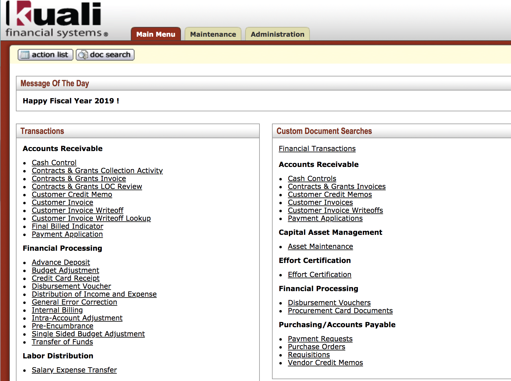

I began working as a fiscal assistant at the Dean's office of School of Ocean and Earth Science and Technology at University of Hawaii at Manoa in November of 2017. Dealing with fiscal reports can get frustrating at times, especially if the reports on the Excel data sheets are linked heavily and thus takes a long time to calculate the data. Due to its extensive running time, it soon became a big problem to manage the data inside the report sheets. Looking through the commands in the cells in the sheet, I realized that a lot of them could be simplified greatly to reduce the time it takes to calculate. Instead of using complex functions such as Index and Match that links between multiple sheets on thousands of cells, I could use simpler commands such as Sumproduct to do the same work. Although it was out of my capability to redesign the whole data sheet for an outstanding performance, I aided in reducing the time to do the calculation to maximize efficiency in the working environment.

I believe that when people think about Microsoft Excel, it simply regard them as a business-related topic. While that is true to a certain extent, I learned that it goes beyond the field of business. Just like how programmers or people within the computer science field use logical expressions to compare data and perform certain functions when the conditions are met, the same concept applies in Excel as well. Just like how different sorting algorithms have different run time complexity despite the identicalness in the result, there are functions in Excel that perform faster than the others under certain conditions. I've also learned to think about other people who will use the data sheet I revise prior to making major changes, as something that is more convenient for me may not be convenient for other people. 

(Due to issues regarding confidentiality, I am not allowed to share an actual image or data of the report.)

```
=INDEX(range, MATCH(lookup_value, lookup_range, match_type)) // an example function, used to look up values

```
